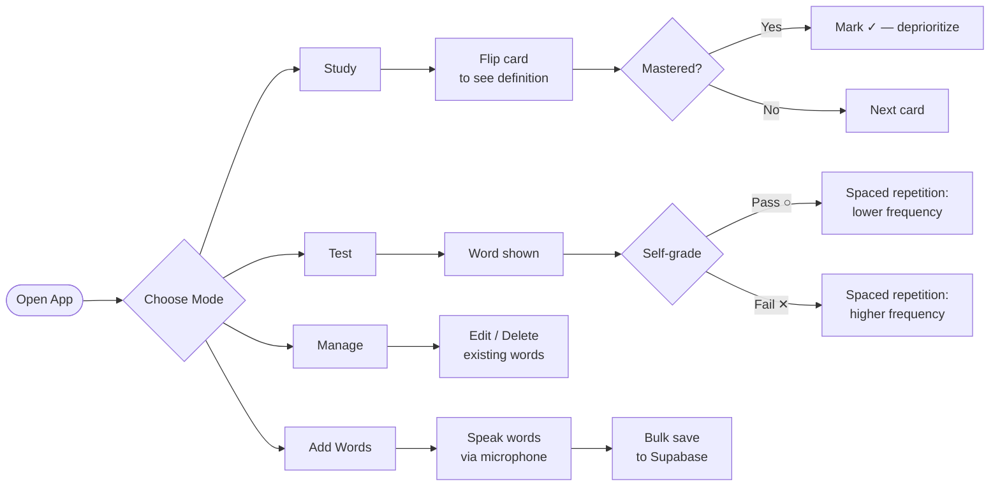
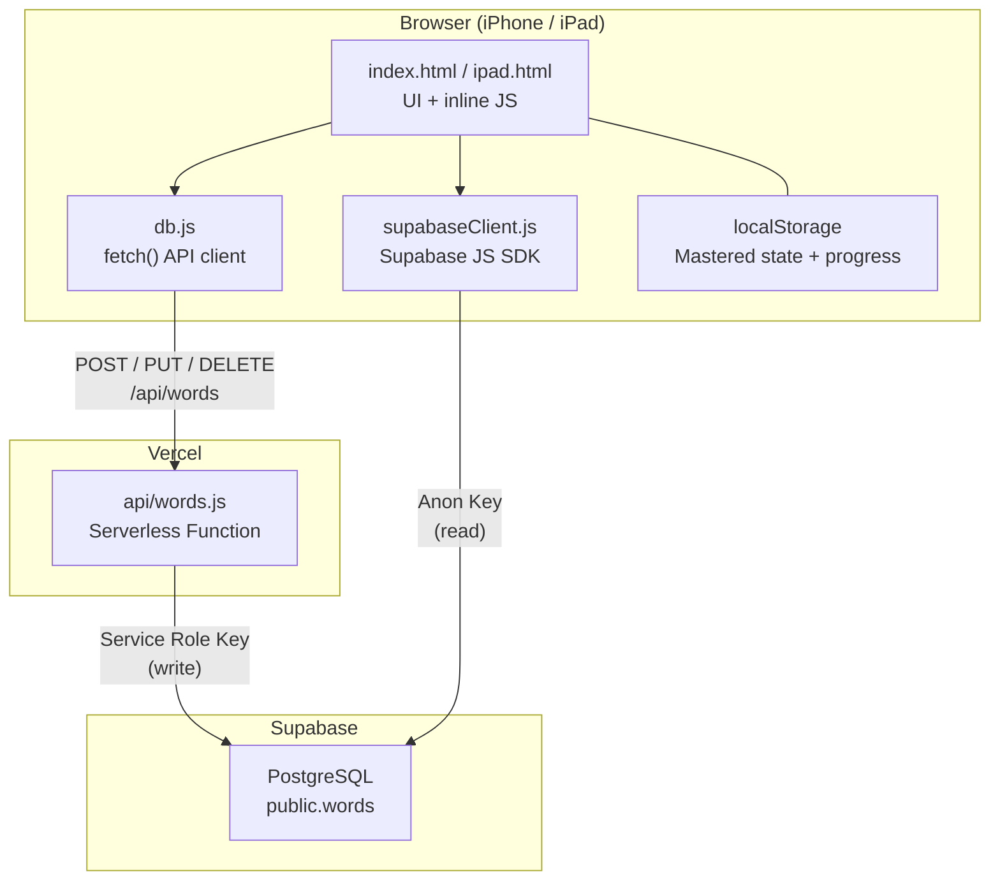

# TOEIC Flashcard App

<div align="center">


**A Progressive Web App for TOEIC vocabulary study — installable on iPhone and iPad.**

</div>

---

## 📌 Overview

TOEIC Flashcard App is a no-framework PWA built with Vanilla JS, Supabase (PostgreSQL), and Vercel serverless functions. It supports four distinct study modes — flashcard flip, self-graded test, word management, and bulk import — with per-word progress tracking persisted to localStorage and a spaced-repetition-friendly design.

The app is optimized for mobile Safari on iPhone and iPad, with safe-area insets, dark mode support, and a Web App Manifest for home-screen installation.

---

## ✨ Features

| # | Feature | Description |
|---|---------|-------------|
| 1 | **Flashcard Study Mode** | Tap a card to flip and reveal the definition, phonetics, part-of-speech badge, TOEIC notes, etymology, bilingual example sentences, and synonyms |
| 2 | **Self-Graded Test Mode** | Display a word, then grade yourself with Pass / Fail buttons; results drive spaced-repetition ordering |
| 3 | **Word Management** | Full CRUD list view — edit definitions, delete entries, and browse all vocabulary in one place |
| 4 | **Bulk Voice Import** | Speak English words via Web Speech API; batch-save with a single tap |
| 5 | **Per-Word Progress Tracking** | Mark words as mastered; mastered count and state persist across sessions via localStorage |
| 6 | **Spaced Repetition Logic** | Words you mark incorrect surface more frequently; mastered words are deprioritized |
| 7 | **Dark Mode** | Automatically applies the system `prefers-color-scheme: dark` preference |
| 8 | **iPhone Layout** | Safe-area insets, fixed bottom nav, swipe-friendly tap zones for prev / next |
| 9 | **iPad Layout** | Wider card area with proportions tuned for iPad screen ratios |
| 10 | **Dynamic Font Sizing** | Word font scales down automatically for long strings to prevent overflow |
| 11 | **PWA Install** | Web App Manifest enables "Add to Home Screen" with standalone display mode |

---

## 🛠 Tech Stack

| Category | Technology | Purpose |
|----------|------------|---------|
| Frontend | HTML5 / CSS3 / Vanilla JavaScript | UI, card flip animations, dark mode, responsive layout |
| Database | Supabase (PostgreSQL) | Persistent word storage with JSONB `meanings` column |
| API Layer | Vercel Serverless Functions (Node.js) | Secure CRUD endpoint — POST / PUT / DELETE via service role key |
| Hosting | Vercel | Static frontend + serverless API on the same domain |
| PWA | Web App Manifest (`manifest.json`) | Home-screen install, standalone display, theme color |
| Dev Server | Node.js built-in HTTP (`server.js`) | Zero-dependency local preview server |
| Auth Strategy | Supabase anon key (reads) + service role key (writes) | Minimizes attack surface without a full auth layer |

---

## 📁 Project Structure

```
toeic-flashcards/
├── index.html            # iPhone-optimized flashcard UI (Study / Test / Manage / Add views)
├── ipad.html             # iPad layout variant — wider card proportions
├── db.js                 # Browser-side API client — fetch() calls to /api/words
├── supabaseClient.js     # Initializes Supabase JS SDK with the anon key (browser reads)
├── manifest.json         # PWA manifest — name, icons, standalone display, theme color
├── supabase-schema.sql   # words table DDL + Row Level Security policies
├── server.js             # Minimal Node.js static server for local development preview
├── netlify.toml          # (Legacy) Netlify deploy config with CORS / cache headers
├── .gitignore            # Excludes node_modules and local env files
├── supabase/             # Supabase CLI project directory (migrations, config)
└── api/
    └── words.js          # Vercel serverless function — REST CRUD handler for /api/words
```

---

## 🚀 Getting Started

### Prerequisites

| Tool | Version | Notes |
|------|---------|-------|
| Node.js | 18+ | Required for local dev server and Vercel CLI |
| Supabase account | — | Free tier is sufficient |
| Vercel account | — | Free tier handles the serverless API |

### 1. Clone and install

```bash
git clone https://github.com/vosnuev/toeic-flashcards.git
cd toeic-flashcards
```

No npm install required — the project has zero runtime dependencies on the frontend.

### 2. Create the Supabase table

Run `supabase-schema.sql` in the Supabase SQL Editor to create the `words` table and RLS policies.

### 3. Configure environment variables

Set these in your Vercel project dashboard (Settings → Environment Variables):

| Variable | Description |
|----------|-------------|
| `SUPABASE_URL` | Your Supabase project URL (e.g. `https://xxxx.supabase.co`) |
| `SUPABASE_SERVICE_ROLE_KEY` | Service role key — used only by the serverless function for write operations |

Also update `supabaseClient.js` with your project URL and anon key for browser-side reads.

### 4. Run locally

```bash
node server.js
# Open http://localhost:4173
```

### 5. Deploy

Push to `main` — Vercel automatically deploys both the static files and `api/words.js` as a serverless function.

---

## 🔄 Usage Flow



---

## 🏗 Architecture



**Key design decisions:**

- All mutation requests route through the Vercel serverless function, keeping the service role key server-side only.
- Direct Supabase reads (anon key) skip the serverless layer for lower latency on card loads.
- `meanings` is stored as JSONB, allowing flexible per-word structure (multiple POS entries, bilingual examples, synonyms) without schema migrations.
- Mastered/progress state lives in localStorage — no login required, zero backend cost.

---

## 🎯 Skills Demonstrated

| Category | Skills | Context |
|----------|--------|---------|
| **Frontend Architecture** | Vanilla JS, DOM manipulation, component-like view switching | Built four distinct views (Study, Test, Manage, Add) inside a single HTML file without any framework |
| **Progressive Web App** | Web App Manifest, standalone display mode, mobile safe-area CSS | Users can install the app on iPhone / iPad home screens; layout respects notch and home indicator |
| **CSS & Responsive Design** | CSS custom properties, `prefers-color-scheme`, dynamic `font-size` scaling, safe-area insets | Dark mode auto-applies; long words shrink automatically; separate iPhone and iPad layouts |
| **Backend as a Service** | Supabase (PostgreSQL), Row Level Security, JSONB data modeling | Designed the `words` table schema with JSONB for flexible meaning structures and RLS for data security |
| **Serverless Functions** | Vercel serverless (Node.js), REST API design, secret management | Implemented a single multi-method endpoint (`GET / POST / PUT / DELETE`) with the service role key held server-side |
| **API Integration** | Supabase JS SDK, fetch API, async/await, error handling | Two-path read strategy: SDK for low-latency reads, serverless proxy for secure writes |
| **Web APIs** | Web Speech API (`webkitSpeechRecognition`), localStorage | Voice-driven bulk word import; client-side progress persistence without a database |
| **DevOps & Deployment** | Vercel CI/CD, environment variable management, static + serverless hybrid hosting | Zero-config deploy on push to `main`; env vars injected at build time |
| **Database Design** | PostgreSQL DDL, RLS policies, JSONB vs normalized schema trade-offs | Chose JSONB over a normalized meanings table to avoid JOIN complexity for a read-heavy mobile app |
| **UX & Performance** | Card flip CSS animation, spaced repetition ordering, tap zone optimization | Smooth 3D card flip; incorrect words surface more often; full-width tap areas for one-handed phone use |

---

## 📄 License

MIT — see [LICENSE](LICENSE) for details.

**References**

- [Supabase Docs](https://supabase.com/docs)
- [Vercel Serverless Functions](https://vercel.com/docs/functions)
- [Web App Manifest — MDN](https://developer.mozilla.org/en-US/docs/Web/Manifest)
- [Web Speech API — MDN](https://developer.mozilla.org/en-US/docs/Web/API/Web_Speech_API)
