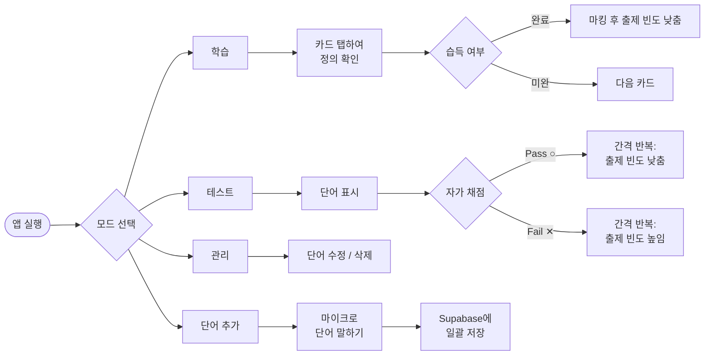
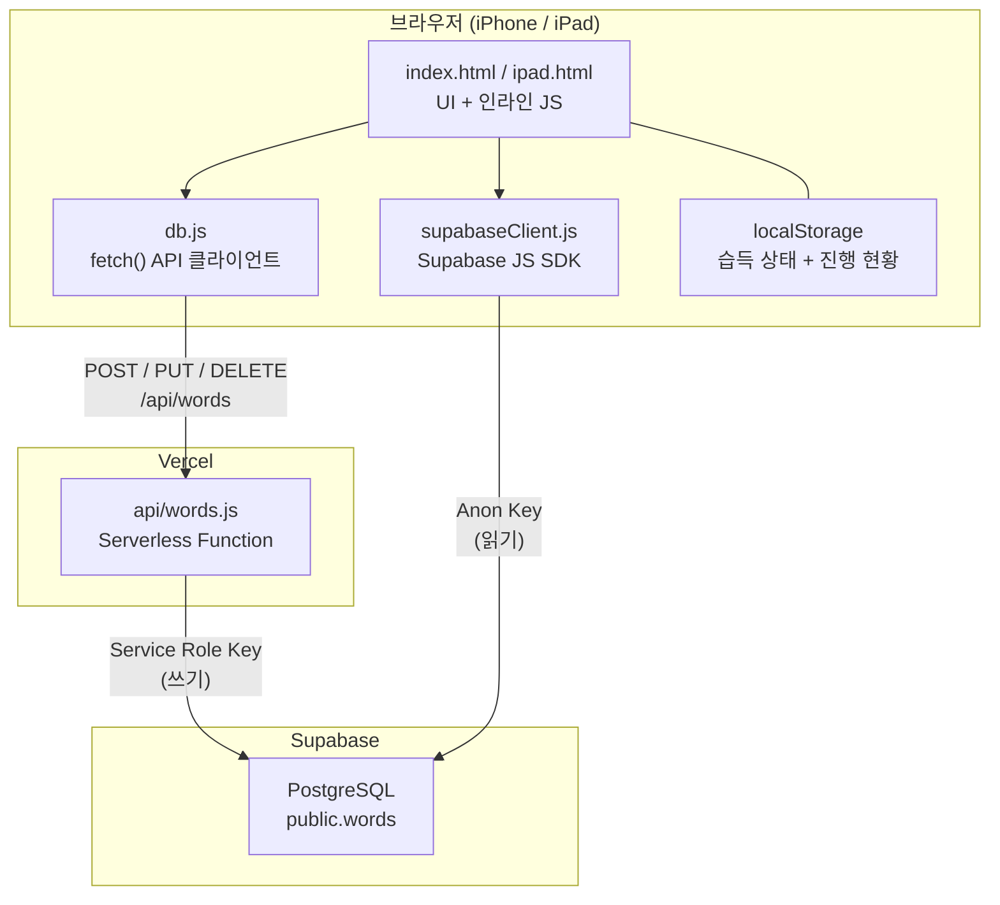

<div align="center">

# TOEIC Flashcard App


**토익 단어를 플래시카드 방식으로 학습하는 PWA 앱**

</div>

---

## 📌 개요

프레임워크 없이 Vanilla JS, Supabase (PostgreSQL), Vercel Serverless Functions만으로 구현한 토익 단어 학습 PWA입니다. 플래시카드 뒤집기, 자가 채점 테스트, 단어 관리, 음성 대량 입력 등 4가지 학습 모드를 지원하며, 학습 진행 상태는 localStorage에 저장되어 별도 로그인 없이도 유지됩니다. iPhone·iPad 홈 화면에 설치할 수 있는 독립형 앱으로 동작합니다.

---

## ✨ 주요 기능

| 번호 | 기능 | 설명 |
|:---:|------|------|
| 1 | **플래시카드 학습** | 카드를 탭하면 뒤집히며 정의, 발음 기호, 품사, TOEIC 노트, 어원, 이중 언어 예문, 유의어를 확인할 수 있습니다 |
| 2 | **자가 채점 테스트** | 단어를 보고 Pass / Fail로 자가 채점하면 틀린 단어가 더 자주 출제됩니다 |
| 3 | **단어 관리 (CRUD)** | 전체 단어 목록에서 정의 수정 및 삭제를 할 수 있습니다 |
| 4 | **음성 대량 입력** | Web Speech API 마이크로 영어 단어를 말하면 일괄 저장됩니다 |
| 5 | **학습 진행 추적** | 단어별 습득 여부 마킹이 세션 종료 후에도 localStorage에 유지됩니다 |
| 6 | **간격 반복 학습** | 틀린 단어는 더 자주, 습득한 단어는 낮은 빈도로 출제됩니다 |
| 7 | **다크 모드** | 시스템 `prefers-color-scheme: dark` 설정을 자동으로 반영합니다 |
| 8 | **iPhone 최적화** | Safe-area inset, 하단 고정 내비게이션, 한 손 사용에 맞는 탭 영역을 제공합니다 |
| 9 | **iPad 최적화** | iPad 화면 비율에 맞게 카드 영역 비율이 조정됩니다 |
| 10 | **동적 폰트 크기** | 긴 단어는 글자 크기가 자동으로 축소되어 화면 밖으로 넘치지 않습니다 |
| 11 | **PWA 설치** | Web App Manifest를 통해 홈 화면에 추가하고 독립형 앱으로 실행할 수 있습니다 |

---

## 🛠 기술 스택

| 분류 | 기술 | 역할 |
|------|------|------|
| Frontend | HTML5, CSS3, Vanilla JavaScript | UI 구성, 카드 뒤집기 애니메이션, 다크 모드, 반응형 레이아웃 |
| Database | Supabase (PostgreSQL) | 단어 영구 저장 - JSONB `meanings` 컬럼 사용 |
| API Layer | Vercel Serverless Functions (Node.js) | 보안 CRUD 엔드포인트 - POST / PUT / DELETE 처리 |
| Hosting | Vercel | 정적 프론트엔드 + Serverless API 통합 배포 |
| PWA | Web App Manifest (`manifest.json`) | 홈 화면 설치, standalone 모드, 테마 색상 설정 |
| 로컬 서버 | Node.js 내장 HTTP (`server.js`) | 의존성 없는 로컬 개발 서버 |

---

## 📁 프로젝트 구조

```
toeic-flashcards/
├── index.html            # iPhone 최적화 메인 UI (학습 / 테스트 / 관리 / 단어추가 뷰)
├── ipad.html             # iPad 레이아웃 변형 - 넓은 카드 비율
├── db.js                 # 브라우저 API 클라이언트 - /api/words 로 fetch() 호출
├── supabaseClient.js     # Supabase JS SDK 초기화 (anon key 사용, 브라우저 읽기 전용)
├── manifest.json         # PWA manifest - 이름, 아이콘, standalone 모드, 테마 색상
├── supabase-schema.sql   # words 테이블 DDL + Row Level Security 정책
├── server.js             # 로컬 개발용 간이 Node.js 정적 서버
├── netlify.toml          # (레거시) Netlify 배포 설정 - CORS / 캐시 헤더
├── .gitignore            # node_modules 및 로컬 환경 파일 제외
├── supabase/             # Supabase CLI 프로젝트 디렉터리 (마이그레이션, 설정)
└── api/
    └── words.js          # Vercel Serverless Function - /api/words REST CRUD 핸들러
```

---

## 🚀 시작하기

### 필수 조건

| 항목 | 버전 | 비고 |
|------|------|------|
| Node.js | 18 이상 | 로컬 개발 서버 및 Vercel CLI 실행에 필요 |
| Supabase 계정 | - | 무료 플랜으로 충분 |
| Vercel 계정 | - | 무료 플랜으로 Serverless API 운용 가능 |

### 환경 변수

Vercel 대시보드 Settings → Environment Variables에서 아래 값을 설정합니다.

| 변수명 | 설명 |
|--------|------|
| `SUPABASE_URL` | Supabase 프로젝트 URL (예: `https://xxxx.supabase.co`) |
| `SUPABASE_SERVICE_ROLE_KEY` | 쓰기 전용 Service Role Key - Serverless Function에서만 사용 |

브라우저 읽기용 anon key는 `supabaseClient.js`에 직접 입력합니다.

### 실행 방법

```bash
# 1. 저장소 클론
git clone https://github.com/vosnuev/toeic-flashcards.git
cd toeic-flashcards

# 2. Supabase SQL Editor에서 테이블 생성
#    supabase-schema.sql 내용을 실행하면 words 테이블과 RLS 정책이 생성됩니다

# 3. 로컬 서버 실행 (런타임 의존성 없음 - npm install 불필요)
node server.js
# → http://localhost:4173 에서 확인

# 4. 배포 - main 브랜치 push 시 Vercel이 자동으로 정적 파일과 api/words.js를 배포합니다
```

---

## 🔄 사용 흐름



---

## 🏗 아키텍처



**핵심 설계 결정:**

- 모든 데이터 변경 요청은 Vercel Serverless Function을 통해 처리하여 Service Role Key를 서버 측에만 보관합니다.
- 읽기 요청은 anon key로 Supabase에 직접 접근해 카드 로딩 지연 시간을 최소화합니다.
- `meanings` 컬럼은 JSONB로 저장하여 품사별 복수 항목, 이중 언어 예문, 유의어 등을 스키마 변경 없이 유연하게 구조화합니다.
- 습득 상태와 진행 현황은 localStorage에 저장되어 로그인 없이, 백엔드 비용 없이 유지됩니다.

---

## 🎯 습득 기술 및 역량

포트폴리오용 - 이 프로젝트에서 배우고 적용한 기술:

| 분류 | 기술 | 적용 내용 |
|------|------|-----------|
| **Frontend 아키텍처** | Vanilla JS, DOM 조작, 컴포넌트형 뷰 전환 | 프레임워크 없이 단일 HTML 파일 안에서 4개 뷰(학습, 테스트, 관리, 추가)를 구현 |
| **Progressive Web App** | Web App Manifest, standalone 모드, Safe-area CSS | iPhone·iPad 홈 화면 설치 지원, 노치·홈 인디케이터 레이아웃 대응 |
| **CSS 및 반응형 디자인** | CSS custom properties, `prefers-color-scheme`, 동적 `font-size`, safe-area inset | 다크 모드 자동 적용, 긴 단어 자동 축소, iPhone·iPad 별도 레이아웃 분리 |
| **Backend as a Service** | Supabase (PostgreSQL), Row Level Security, JSONB 데이터 모델링 | JSONB 기반 유연한 meanings 테이블 설계, RLS로 데이터 보안 확보 |
| **Serverless Functions** | Vercel Serverless (Node.js), REST API 설계, 시크릿 관리 | 단일 멀티 메서드 엔드포인트(GET/POST/PUT/DELETE) 구현, Service Role Key 서버 측 격리 |
| **API 연동** | Supabase JS SDK, fetch API, async/await, 에러 처리 | 읽기는 SDK 직접 호출(저지연), 쓰기는 Serverless 프록시 경유(보안) 이중 경로 전략 |
| **Web APIs** | Web Speech API (`webkitSpeechRecognition`), localStorage | 음성 기반 단어 대량 입력, 클라이언트 측 진행 상황 영속화 |
| **DevOps 및 배포** | Vercel CI/CD, 환경 변수 관리, 정적+Serverless 하이브리드 호스팅 | main 브랜치 push 시 무설정 자동 배포, 빌드 타임 환경 변수 주입 |
| **데이터베이스 설계** | PostgreSQL DDL, RLS 정책, JSONB vs 정규화 트레이드오프 분석 | 읽기 중심 모바일 앱에서 JOIN 복잡도를 피하기 위해 JSONB 선택 |
| **UX 및 성능** | 카드 뒤집기 CSS 애니메이션, 간격 반복 정렬, 탭 영역 최적화 | 부드러운 3D 카드 플립, 오답 단어 우선 출제, 한 손 사용을 위한 전폭 탭 영역 |

---

## 📄 라이선스

MIT License - 자세한 내용은 [LICENSE](LICENSE) 파일을 참고하세요.

**참고 문서**

- [Supabase Docs](https://supabase.com/docs)
- [Vercel Serverless Functions](https://vercel.com/docs/functions)
- [Web App Manifest - MDN](https://developer.mozilla.org/en-US/docs/Web/Manifest)
- [Web Speech API - MDN](https://developer.mozilla.org/en-US/docs/Web/API/Web_Speech_API)
